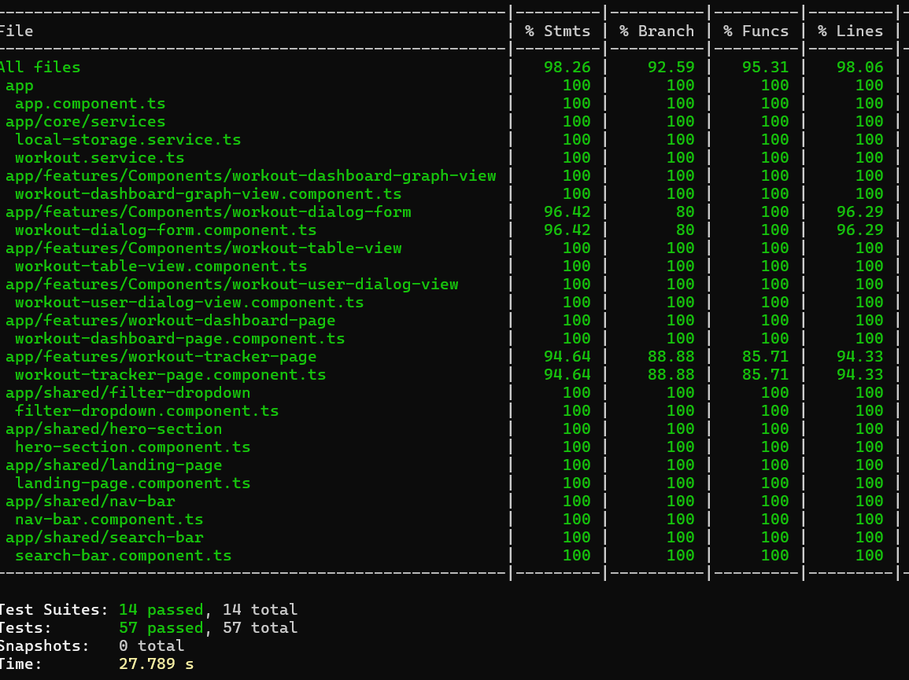
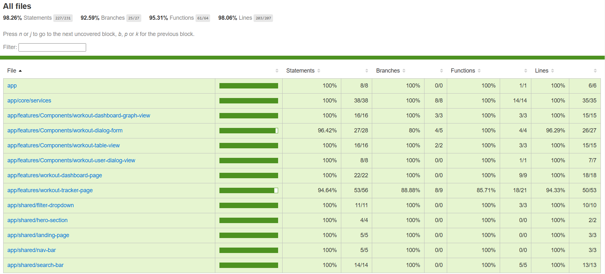
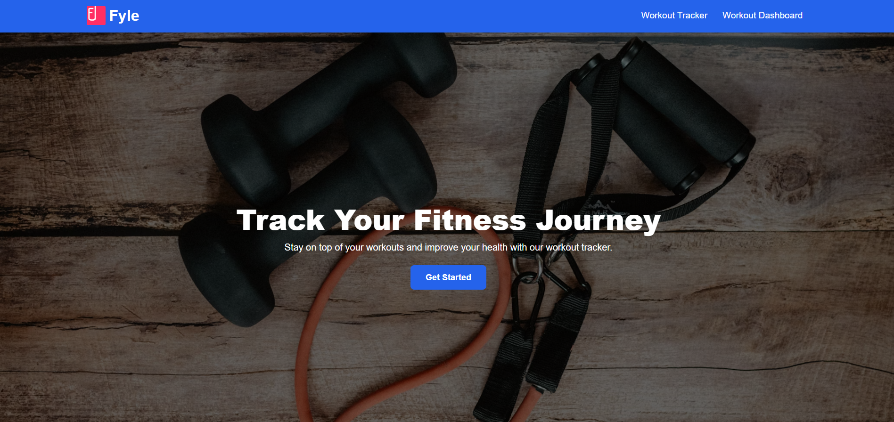
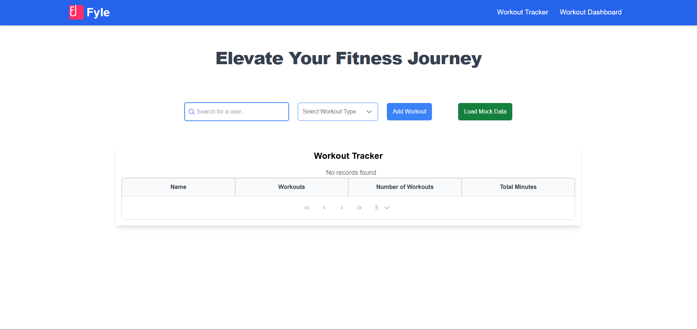
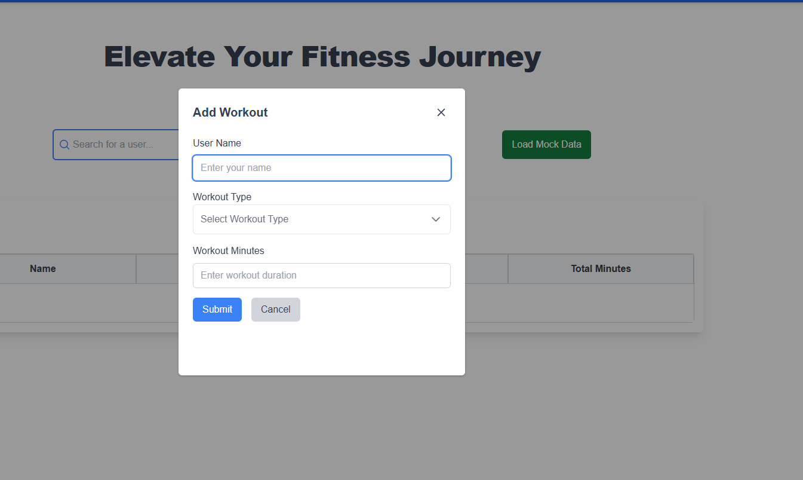
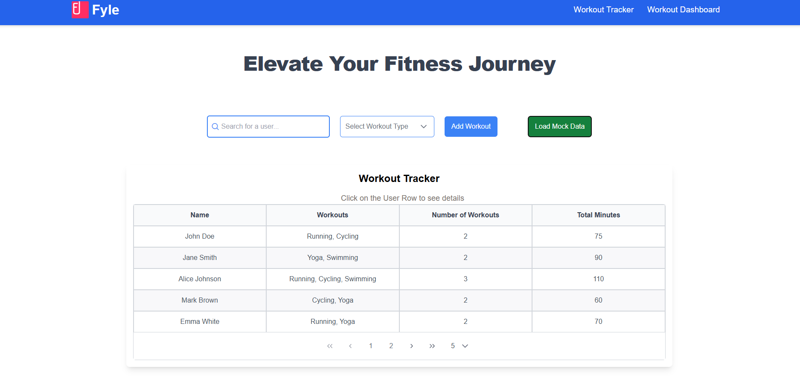
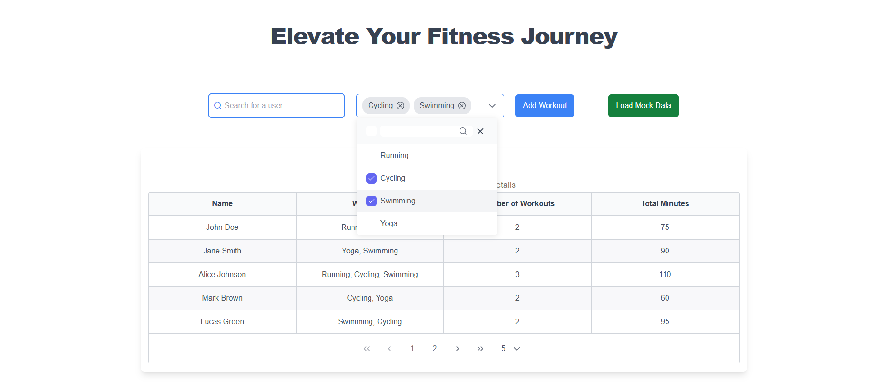
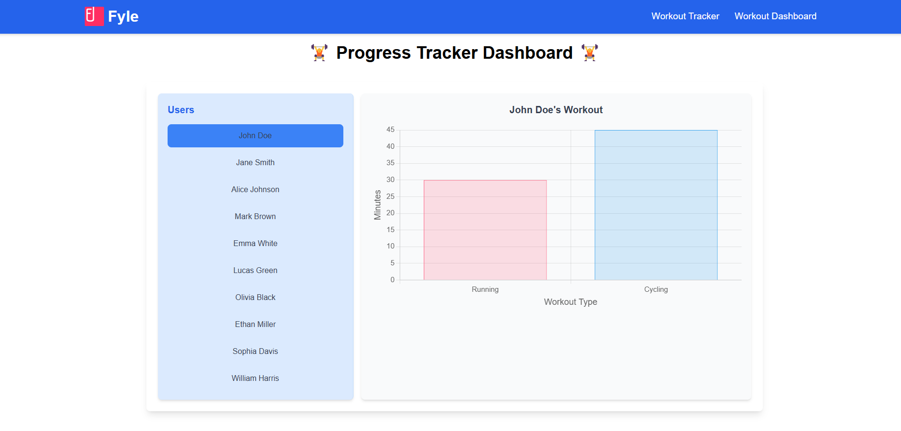

# HealthChallengeTracker

This project is a Health Challenge Tracker application built with Angular. The application allows users to track their workouts, view individual user information, and visualize user data through various features. The project aims to provide a comprehensive solution for managing and analyzing workout data.

## Submission
### Deployment Link : [Health Challenge Tracker](https://fyle-health-challenge-tracker-app.netlify.app/)

### GitHub Repository : [Health Challenge Tracker Repository](https://github.com/amit429/health-challenge-tracker-Fyle-Assignment)

## Features
- **Adding User**: Users can add new workout entries, including the type of workout and the duration in minutes.
- **User Info Dialog**: Clicking on a user row opens a dialog with detailed workout information.
- **User Data Table**: Displays a table of users with workout details, including types, number, and total minutes of workouts.
- **Bar Graph Visualization**: Generates a bar graph to visualize workout data for each user.
- **Mock Data Loading**: Loads mock data to simulate user workout entries for testing and demonstration.
- **Search Functionality**: Allows users to search for specific users by name.
- **Filter Functionality**: Filters users by workout type to view specific workout activities.

### Code Coverage Screen Shots:

### Project Snapshots:

## Development server

Run `ng serve` for a dev server. Navigate to `http://localhost:4200/`. The application will automatically reload if you change any of the source files.

## Build

Run `ng build` to build the project. The build artifacts will be stored in the `dist/` directory.

## Running unit tests

Run `npm run test` to execute the unit tests via [jest](https://jestjs.io/).

Run `npm run test:coverage` to generate a code coverage report. The report will be stored in the `coverage/` directory.

## Further help

To get more help on the Angular CLI use `ng help` or go check out the [Angular CLI Overview and Command Reference](https://angular.io/cli) page.